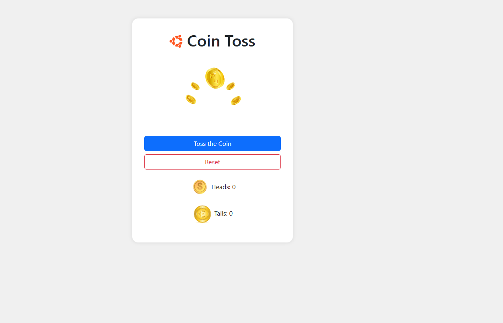

# 🪙 Coin Toss

Une application web simple et ludique qui simule le lancer d’une pièce de monnaie (pile ou face) avec une animation visuelle et un résultat aléatoire.

---

## 📋 Description Générale

**_Coin Toss_** est un mini-jeu interactif dans lequel l'utilisateur peut :

Lancer une pièce virtuelle en cliquant sur un bouton

Obtenir un résultat aléatoire : 🪙 Heads (Pile) ou Tails (Face)

Voir une animation ou image correspondant au résultat

Suivre le score total de pile et face

Réinitialiser le compteur à tout moment

---

## 🚀 Fonctionnalités Principales

🎲 Génération aléatoire du résultat (Heads ou Tails)

🖼️ Affichage d'une image ou animation pour chaque face de la pièce

🧮 Compteur du nombre de fois où chaque face est apparue

🔁 Bouton de réinitialisation

🧩 Interface simple et responsive

🎉 (Optionnel) Effets sonores ou animations

---

## 🛠️ Technologies Utilisées

🌐 HTML5 — structure de la page

🎨 CSS3 / Bootstrap 5 — style et mise en page responsive

⚙️ JavaScript / jQuery — logique de génération aléatoire et interaction

---

## 📸 Capture d’écran

Ajoute ici un aperçu si tu veux :



## 🔗 Démo en ligne

👉 [Clique ici pour essayer Coin Toss](https://projectsjavascript.github.io/Coin-Toss/)

## 📁 Structure du projet

```

Coin Toss/
├──JQuery
├──jquery-3.7.1.min.js
├── index.html
├── screenshot.png
├── script.js
├── coin-toss.png
├── dollar.png
├── Euro.png
└── README.md

```

## 📄 Licence

Ce projet est open-source sous licence MIT.

### 🌐 Langue / Language

- 🇫🇷 [Lire en Français](./README.fr.md)
- 🇬🇧 [Read in English](./README.md)

```

```
